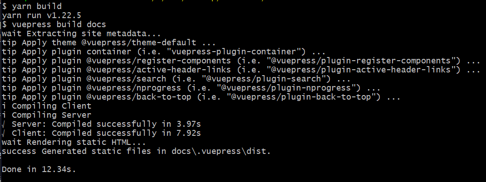
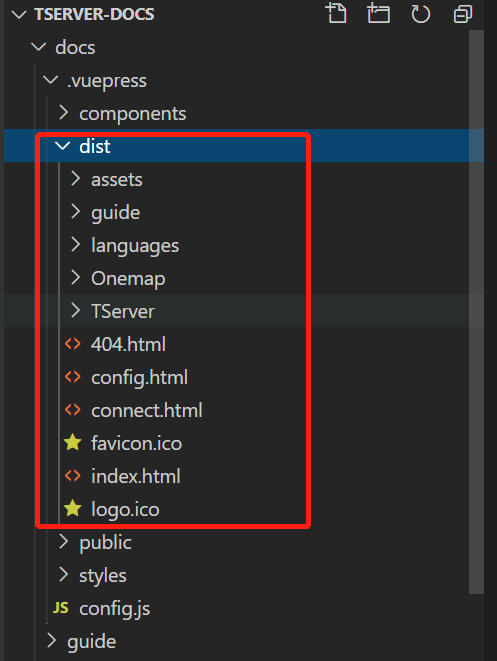
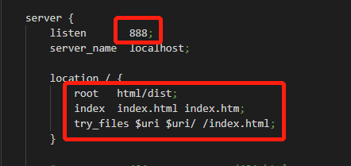
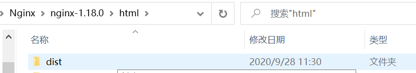
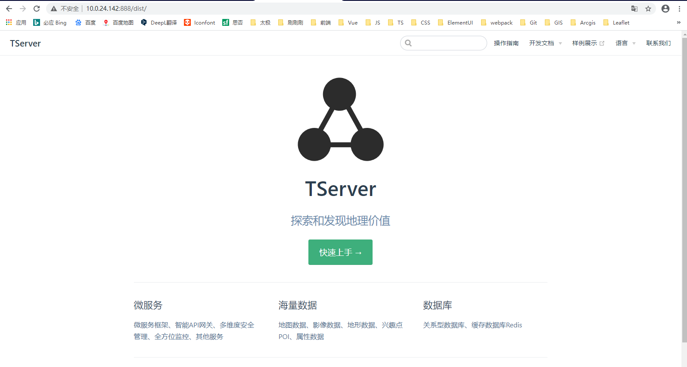
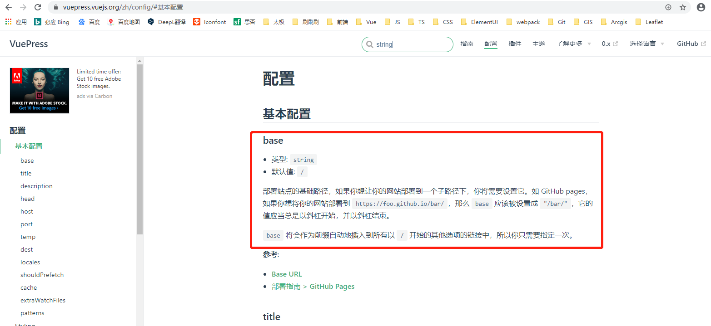

# Vuepress practice

## 使用 
  ```js
    // 初始化依赖包
    yarn
    或 npm install
  ```
  ```js
  // 运行
    yarn dev 
    或 npm run dev
  ```

  ## 一些小tip
  + 1、`打包部署`

    打包部署使用命令 `yarn build` 或 `npm run build`, 在`config`中的`dest`设置的就是打包后文件所在的位置，部署时只需要将`dest`指向的文件放入指定的服务器位置即可。<br>

    - 1、使用nginx部署

      此处`dest`指向的是`./docs/.vuepress/dist`,也就是将整个dist文件里的内容放至nginx的html根下即可，前提是html没有其他东西，视情况而定。<br>

      + 1.1 打包命令
      ```js
        yarn build 
        # npm run build
        // 默认的是 yarn docs:build, 取决于你是怎么定的scripts脚本
      ```
      + 1.2 打包成功

      
      
      

      + 1.3 nginx配置

      打开nginx的conf文件，编辑`nginx.conf`，

      

      

      + 1.4 启动 nginx

      

    - 2、tomcat部署

      同理可得（啊，怀念高中数学嘻嘻）

  + 2、`部署时出现的样式无法出现の问题`

    请通读 [Vuepress文档的配置！](https://vuepress.vuejs.org/zh/config/#%E5%9F%BA%E6%9C%AC%E9%85%8D%E7%BD%AE)

    

    讲解一下，主要就是你部署的位置与这个base写的要一致，比如部署的不是根目录，而是html下的dist，所以此时，你要将 `base`配置为：
    ```js
      module.exports = {
        base: '/dist/', // 打包部署的基础路径，设置不对会导致css样式无法加载等问题
        title: 'TServer',
        description: '探索和发现地理价值',
        head: [
            ['link', {
                rel: 'icon',
                href: `/favicon.ico`
            }]
        ],
        dest: './docs/.vuepress/dist', // build 打包后生成的文件位置
        host: 'localhost',
        port: 999,
        ga: '',
        evergreen: true,
        themeConfig: {}
      }
    ```