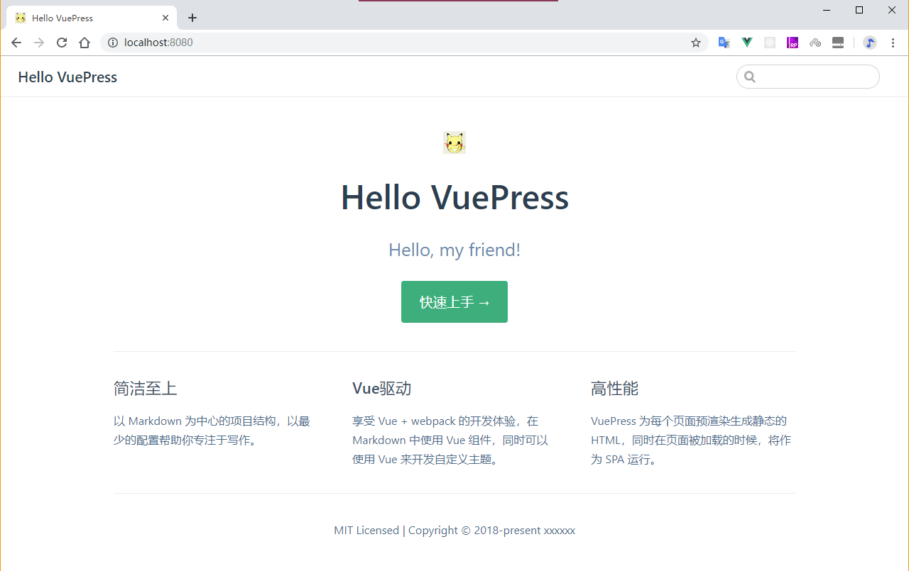

# `初始化项目`
+ `初始化`
  ```js
    npm init -y
  ```
  初始化后会生成 `package.json`，进入编辑,主要是修改scripts内容：
  ```js
    {
      "name": "vuepress-demo",
      "version": "1.0.0",
      "description": "",
      "main": "index.js",
      "scripts": {
        "dev": "vuepress dev docs",
        "build": "vuepress build docs"
      },
      "keywords": [],
      "author": "",
      "license": "ISC"
    }
  ```
+ `建立基础目录`
  ```js
    vuepress-demo
    ├─package.json
    ├─docs
    |  ├─README.md
    |  ├─.vuepress
    |  |  ├─config.js
  ```
  1、编辑 `docs/README.md`，随便写点东西：

  ```js
    ---
    home: true
    heroImage: /favicon.ico
    actionText: 快速上手 →
    actionLink: /guide/
    features:
    - title: 简洁至上
      details: 以 Markdown 为中心的项目结构，以最少的配置帮助你专注于写作。
    - title: Vue驱动
      details: 享受 Vue + webpack 的开发体验，在 Markdown 中使用 Vue 组件，同时可以使用 Vue 来开发自定义主题。
    - title: 高性能
      details: VuePress 为每个页面预渲染生成静态的 HTML，同时在页面被加载的时候，将作为 SPA 运行。
    footer: MIT Licensed | Copyright © 2020-present map.taiji.com.cn
    ---
  ```

  2、修改配置文件 - `docs/.vuepress/config.js` :

  ```js
    module.exports = {
        title: 'Hello VuePress',
        description: 'Hello, my friend!',
        head: [
            ['link', {
                rel: 'icon',
                href: `/favicon.ico`
            }]
        ],
        dest: './docs/.vuepress/dist',
        ga: '',
        evergreen: true,
    }
  ```
+ 运行 预览
  ```js
    npm run dev
  ```
  运行上述代码，根据提示打开网址 http://localhost:8080/  <br>
  （端口号可根据配置进行修改 https://vuepress.vuejs.org/zh/config/#port ） <br>
  如果照做下来，应该能预览到如下页面：

  