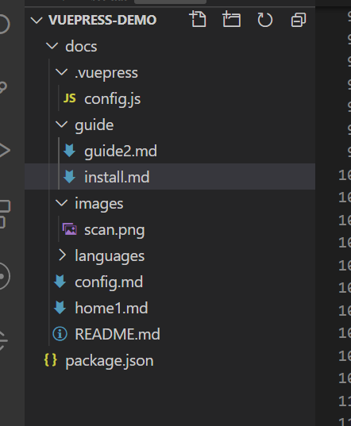
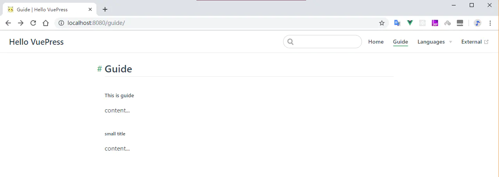

# `导航栏nav`

  首先在 `docs`下创建如下图的目录：

  


  **`每个文件夹下的README.md就是当前目录的内容；`** <br>

  通过config.js文件配置相应导航

  ```js
    themeConfig: {
      nav: [
        { text: 'Home', link: '/' },                      // 根路径
        { text: 'Guide', link: '/guide/install' },
        { text: 'External', link: 'https://cn.bing.com' }, // 外部链接
        // 显示下拉列表
        {
          text: 'Languages',
          items: [
            { text: 'Chinese', link: '/languages/chinese' },
            { text: 'English', link: '/languages/english' }
          ]
        },
        // 下拉列表显示分组
        {
          text: '高级',
          items: [
            { 
              text: '算法', 
              items: [
                { text: '冒泡', link: '/languages/chinese' },
                { text: '快速', link: '/languages/english' }
              ] 
            },
            { 
              text: '设计模式', 
              items: [
                { text: '工厂', link: '/languages/chinese' },
                { text: '单例', link: '/languages/english'},
              ] 
            },
          ]
        }
      ]
    }
  ```

  在对应的md下随便写点东西。<br>

  重新执行命令 `npm run dev`,即可看到如下内容:

  