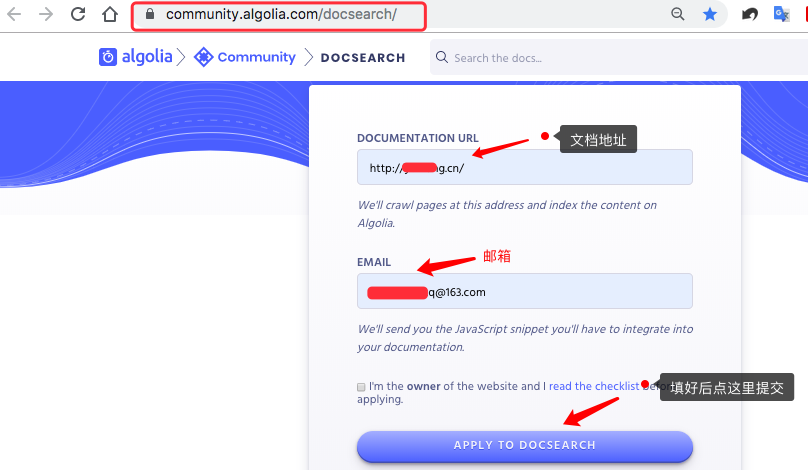
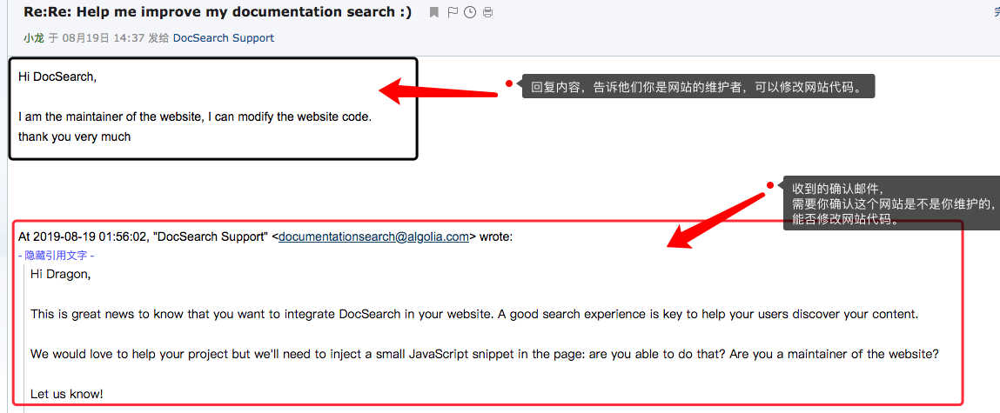
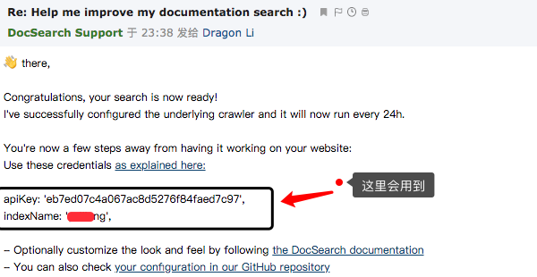
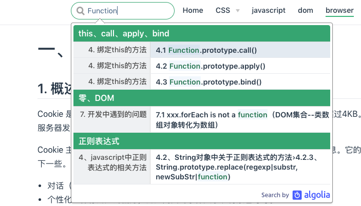

# `搜索框`

## 内置搜索框

  &emsp;&emsp;你可以通过设置 themeConfig.search: false 来禁用默认的搜索框，或是通过 themeConfig.searchMaxSuggestions 来调整默认搜索框显示的搜索结果数量：
  ```js
    // .vuepress/config.js
    module.exports = {
      themeConfig: {
        search: false,
        searchMaxSuggestions: 10
      }
    }
  ```
  你可以通过在页面的 frontmatter 中设置 tags 来优化搜索结果：
  ```js
    ---
    tags:
      - 配置
      - 主题
      - 索引
    ---
  ```
  你可以通过在页面的 frontmatter 中设置 search 来对单独的页面禁用内置的搜索框：
  ```js
    ---
    search: false
    ---
  ```
  > 内置搜索只会为页面的标题、h2 、 h3 以及 tags 构建搜索索引。 如果你需要全文搜索，你可以使用 Algolia 搜索。

## `Algolia`搜索

  &emsp;&emsp;你可以通过 themeConfig.algolia 选项来用 Algolia 搜索 替换内置的搜索框。要启用 Algolia 搜索，你需要至少提供 apiKey 和 indexName：
  ```js
    // .vuepress/config.js
    module.exports = {
      themeConfig: {
        algolia: {
          apiKey: '<API_KEY>',
          indexName: '<INDEX_NAME>'
        }
      }
    }
  ```
  > 注意： 不同于开箱即用的 内置搜索，Algolia 搜索 需要你在使用之前将你的网站提交给它们用于创建索引。

### `Algolia具体使用方法`
+ 1、打开 [Algolia DocSearch](https://docsearch.algolia.com/)，大约在最下面，输入自己的文档地址和邮箱。

  

+ 2、Algolia DocSearch会发送确认邮件，收到后需要回复一下这个网站是你自己的，并且可以修改网站代码：

  

+ 3、Algolia DocSearch会发送一封使用邮件，里面有apiKey和indexName：

  

+ 4、在配置文件中添加如下内容, apiKey和indexName就是上面邮件中的内容：

  ```js
    module.exports = {
      themeConfig: {
        algolia: {
          apiKey: '<API_KEY>',
          indexName: '<INDEX_NAME>'
        }
      }
    }
  ```

  `最终效果：`

  

  `具体使用方法此处鸣谢` [dragon博主](https://segmentfault.com/a/1190000017055963)

  详见Algolia的文档： [Algolia文档](https://github.com/algolia/docsearch#docsearch-options)